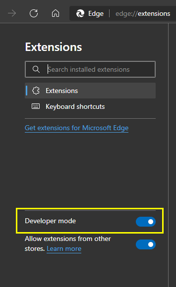

# Chrome Extension Template (Manifest V3)

## Get Started
- Install dependencies
```
npm i
```

- Build for production
```
npm run build
```

- Run in development mode
```
npm run dev
```

## Load extension in browser locally
- Turn on developer mode in (`chrome://extensions` or `edge://extensions`)


- Then click on `Load unpacked`
- Select `dist` folder inside this repo folder(It will get generated after running either `build` or `dev` command)
